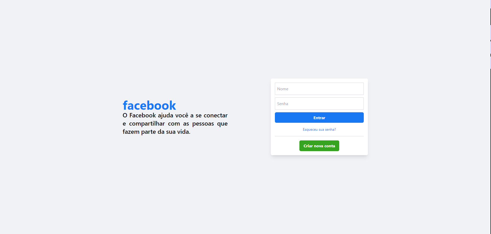

# cloneFacebook

<h1 align="center">Facebook - Clone </h1>

Esse projeto foi feito para o estudo do tailwind, por isso se trata de algo visual e não funcional.. 

  <a href="#-tecnologias">Tecnologias</a>&nbsp;&nbsp;&nbsp;|&nbsp;&nbsp;&nbsp;
  <a href="#-projeto">Projeto</a>&nbsp;&nbsp;&nbsp;|&nbsp;&nbsp;&nbsp;
  <a href="#memo-licença">Licença</a>

  

 

 
    

## 🚀 Tecnologias

-Nesse projeto foi utilizado as seguintes tecnologias:

-Tailwind  
-HTML  
-JS  
-Github  

## 💻 Projeto

Esse site foi feito usando do tailwind para aperfeiçoamento das habilidades com esse framework, por isso o site conta somente com algumas funcionalidades básicas..

- [Visite o projeto online](https://clone-facebook-blue.vercel.app/)

Esse projeto está sob a licença MIT.

---

Feito com ♥ by Helena Lima

